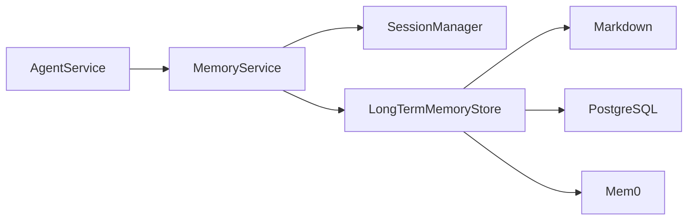

# AgentOS-memory 代码导读

当前模块只有 `package-info.java`，还没有实际 Memory 类。

设计目标是由 `MemoryService` 统一提供记忆能力：

```mermaid
flowchart LR
    A[AgentService] --> M[MemoryService]
    M --> S[SessionManager]
    M --> L[LongTermMemoryStore]
    L --> MD[Markdown]
    L --> PG[PostgreSQL]
    L --> MEM[Mem0]
```

计划包含会话消息、长期记忆、`save_memory` 和 `recall_memory`。当前文档描述的是边界，不代表实现已经存在。

