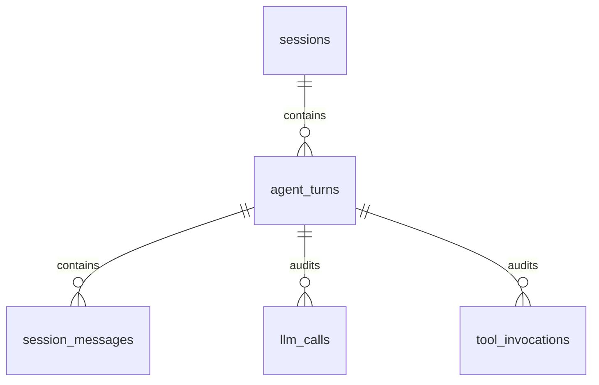

# AgentOS-storage 代码导读

当前模块只有模块说明，数据库实体、Repository 和 Flyway 脚本还没有加入。

设计目标是保存：

```mermaid
erDiagram
    sessions ||--o{ agent_turns : contains
    agent_turns ||--o{ session_messages : contains
    agent_turns ||--o{ llm_calls : audits
    agent_turns ||--o{ tool_invocations : audits
```

项目约定使用 PostgreSQL、Flyway，并关闭 `spring.jpa.open-in-view`。LLM 调用和工具调用不应被一个长事务包住。

