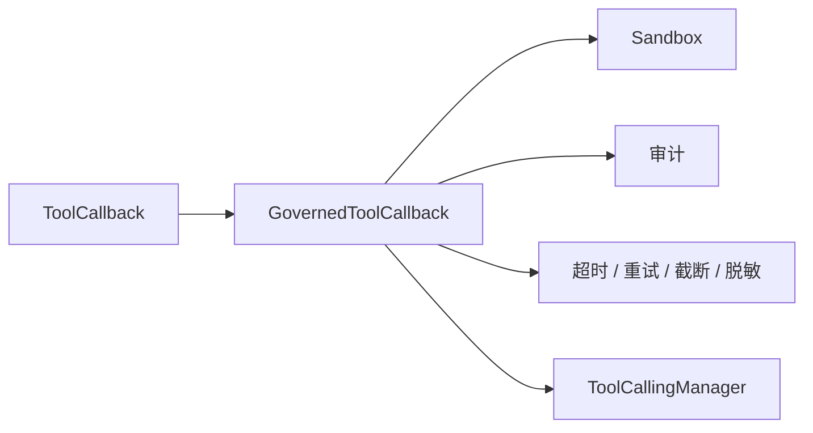

# AgentOS-tool 代码导读

当前模块只有模块说明，实际 Tool 类还没有加入。

设计上的统一入口是：

```mermaid
flowchart LR
    T[ToolCallback] --> G[GovernedToolCallback]
    G --> S[Sandbox]
    G --> A[审计]
    G --> X[超时 / 重试 / 截断 / 脱敏]
    G --> E[ToolCallingManager]
```

文件、Shell、HTTP、通知和 MCP 工具最终都应经过统一治理层，避免不同入口各自执行一套安全和审计逻辑。

